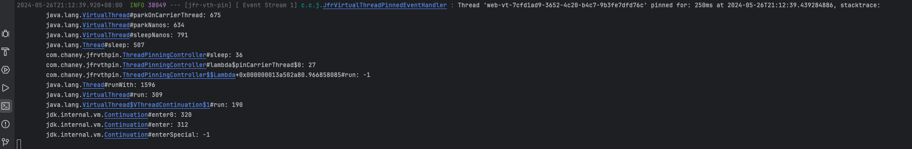
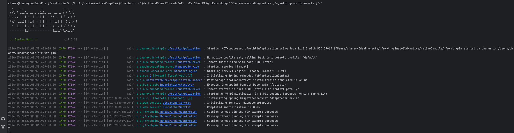

## 当前的问题是：

用jar包启动后
```bash
    java -jar build/libs/jfr-vth-pin-0.0.1-SNAPSHOT.jar
```
访问接口
```bash
    curl --request POST \
         --url 'http://localhost:8080/pinning'
```
可以正常看到日志，来自 [JfrVirtualThreadPinnedEventHandler.java](src%2Fmain%2Fjava%2Fcom%2Fchaney%2Fjfrvthpin%2FJfrVirtualThreadPinnedEventHandler.java)

```text
Thread '{}' pinned for: {}ms at {}, stacktrace
```
但是打包成native-image 可执行文件后，
```groovy
    gradle nativeCompile
```
启动
```bash
    ./build/native/nativeCompile/jfr-vth-pin -XX:StartFlightRecording="filename=recording.jfr,settings=continue+vth.jfc"
```
其中的 jfc文件 是开启了VirtualThreadPinned事件的
```xml
  <event name="jdk.VirtualThreadPinned">
    <setting name="enabled">true</setting>
    <setting name="stackTrace">true</setting>
    <setting name="threshold">0 ns</setting>
  </event>
```
再次访问上面的接口，发现没有按照预期输出 虚拟线程pin日志


